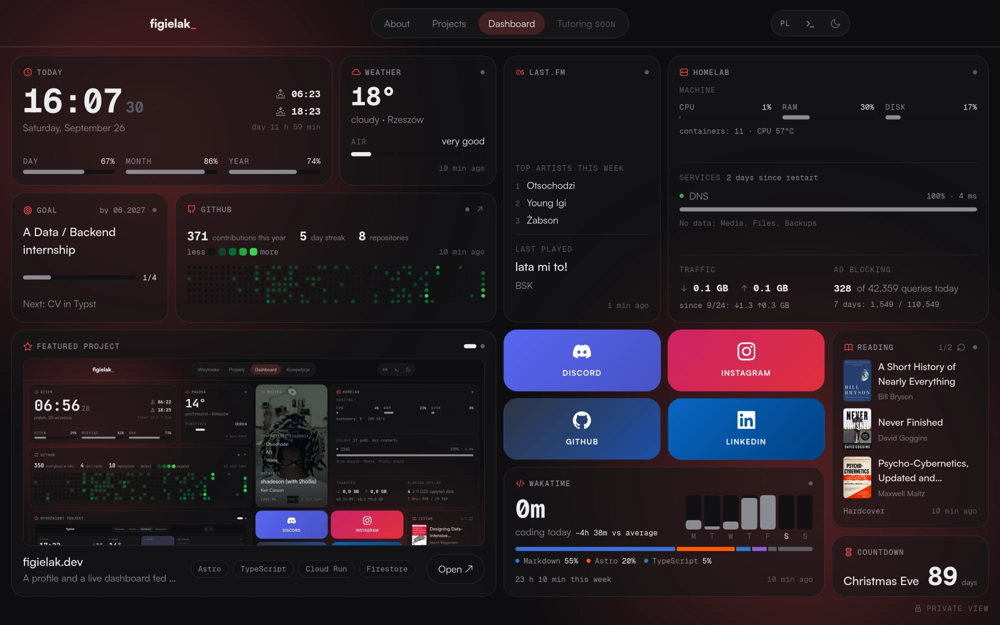
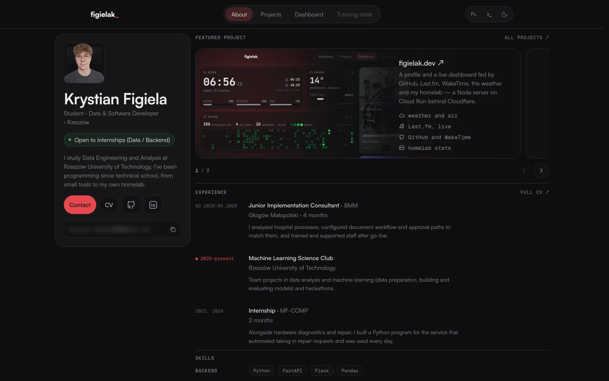
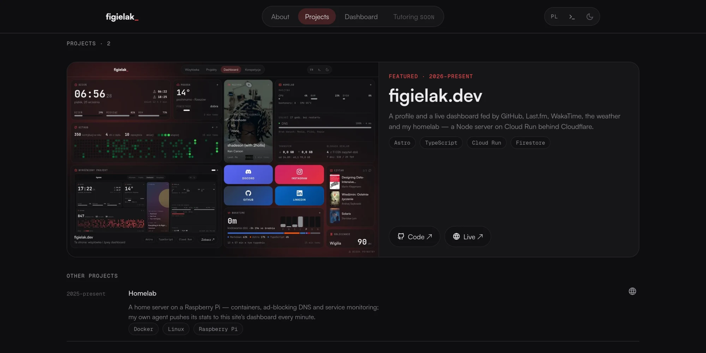
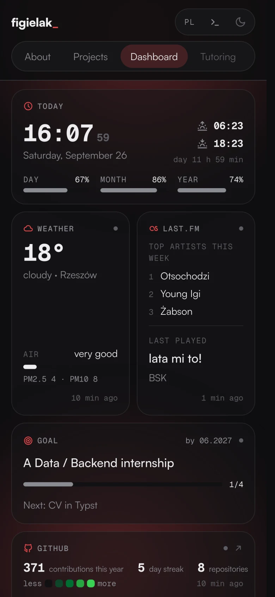
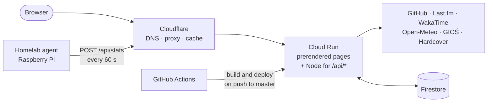

<div align="center">

<a href="https://figielak.dev">
  <picture>
    <source media="(prefers-color-scheme: dark)" srcset=".github/assets/logo-dark.svg">
    
  </picture>
</a>

<p>My personal site: a profile, projects and a <b>live dashboard</b>. Graphite, rounded tiles, one red accent.</p>

<p>
  <a href="https://figielak.dev/en/"><b>figielak.dev</b></a> ·
  <a href="https://figielak.dev/en/dashboard">Dashboard</a> ·
  <a href="https://figielak.dev/en/projects">Projects</a> ·
  <a href="https://figielak.dev/cv/cv-en.pdf">CV</a>
</p>

<p>
  <a href="https://github.com/figielak/figielak.dev/actions/workflows/deploy.yml"></a>
  
  
  
  <a href="LICENSE"></a>
</p>

<a href="https://figielak.dev/en/dashboard">
  
</a>

<table>
  <tr>
    <td width="42%"><a href="https://figielak.dev/en/"></a></td>
    <td width="42%"><a href="https://figielak.dev/en/projects"></a></td>
    <td width="16%"></td>
  </tr>
</table>

</div>

## Highlights

- **Live data, honestly shown.** Tiles read GitHub, Last.fm, WakaTime, Open-Meteo, GIOŚ (air quality)
  and Hardcover through the site's own `/api/*` with server-side caching — no API keys in the
  browser. Every live tile has four states (loading, OK, stale, error) and never changes size.
- **Homelab over push, not pull.** An agent on a Raspberry Pi sends anonymised stats every
  minute; the homelab itself stays reachable only over Tailscale.
- **Private panel** behind a server-side password: services, server history, backups, deploys,
  site analytics, tutoring calendar, expiring tokens and the goal editor.
- **A terminal on every page** — press <kbd>`</kbd>. Each command is its own module.
- **Static by default.** Pages are prerendered; JavaScript ships only with live and interactive
  tiles, in plain TypeScript without a framework.
- **One design system, two layouts:** a bento grid for the dashboard, a two-column "dossier" for
  the profile. Colours, radii and spacing come only from tokens.
- **Bilingual** (PL/EN) without an i18n library, `prefers-reduced-motion` respected, WCAG AA
  contrast, CV typeset in [Typst](https://typst.app).

## How it works



| View | Path | For |
|---|---|---|
| Profile | [`/`](https://figielak.dev/en/) | recruiters and collaborators — who I am, what I do, how to reach me |
| Projects | [`/projects`](https://figielak.dev/en/projects) | a featured project, a list and case studies in MDX |
| Dashboard | [`/dashboard`](https://figielak.dev/en/dashboard) | live data: GitHub, WakaTime, homelab, music, books, weather in Rzeszów |
| Private dashboard | `/dashboard/private` | me — behind a password |
| Tutoring | `/maths` | students and parents (Polish only, in preparation) |

Polish lives at the root, English under `/en/`.

## Stack

[Astro](https://astro.build) 7 + MDX · Tailwind CSS v4 with custom tokens · Satoshi and Geist Mono ·
KaTeX · Typst · Node (`@astrojs/node`) for `/api/*` · Firestore · Google Cloud Run behind
Cloudflare · GitHub Actions with Workload Identity Federation.

## Development

<details>
<summary><b>Getting started</b></summary>

Requires Node ≥ 22.12.

```sh
npm install
cp .env.example .env     # fill in — without it the site shows placeholders
npm run dev              # http://localhost:4321  (add -- --host for your LAN)
```

| Command | What it does |
|---|---|
| `npm run dev` | dev server with live reload |
| `npm run build` | build into `dist/` (`client/` — static files, `server/` — Node) |
| `npm run preview` | preview the build |
| `node dist/server/entry.mjs` | production server locally, as on Cloud Run |
| `npm run cv` | CV from Typst into `public/cv/cv-{pl,en}.pdf` (needs [`typst`](https://github.com/typst/typst)) |

`/dev/tiles` (only in `npm run dev`) shows every live tile in all four states.

</details>

<details>
<summary><b>Environment variables</b></summary>

The repository is public, so personal data and host names stay out of the code. The full list of
keys is in [`.env.example`](.env.example).

| Variable | Read at | In production |
|---|---|---|
| `CONTACT_EMAIL`, `CONTACT_PHONE` | build | GitHub Secrets |
| `HOMELAB_DOMAIN` | build | GitHub Secrets |
| `DASHBOARD_PASSWORD` and API tokens | server start | Secret Manager → Cloud Run |

Without them the build still works with neutral placeholders, and the private view refuses
everyone (except in `npm run dev`). The one exception is the CV: the e-mail and phone number are
written into `cv/*.typ` and the PDFs, which show them in plain text anyway.

</details>

<details>
<summary><b>Project structure</b></summary>

```text
src/
  components/
    ui/        # Tile, Dossier, Nav, Terminal… — building blocks of the design system
    tiles/     # one component per tile, all built on <Tile>
    views/     # whole views: Home, Projects, Maths, Dashboard, DashboardPrivate
  content/     # projects as MDX
  layouts/     # BaseLayout
  pages/       # routes (Polish at the root, English under /en/), api/ — endpoints
  lib/         # data and logic; server/ — API clients, cache, Firestore
  scripts/     # live tiles, dashboard intro, spotlight, terminal
  i18n/        # pl.json, en.json
  styles/      # tokens.css, global.css
cv/            # CV sources in Typst and fonts (PDFs in public/cv/)
docs/          # koncept.md, deploy.md
.github/       # deploy workflow and README assets
Dockerfile     # Cloud Run image (packs the prebuilt dist/)
```

The logo and the social preview are generated with Typst — the command is at the top of each
`.typ` file in [`.github/assets/`](.github/assets).

</details>

<details>
<summary><b>Deployment</b></summary>

A push to `master` → GitHub Actions builds the site with its secrets → an image with the prebuilt
`dist/` goes to Cloud Run → Cloudflare (proxied DNS, SSL, 301 redirects, caching, rate limiting)
serves it at `figielak.dev`. One-time setup and troubleshooting: [docs/deploy.md](docs/deploy.md).

</details>

The project docs are in Polish: [docs/koncept.md](docs/koncept.md) is the source of truth for the
design, views and rules, [AGENTS.md](AGENTS.md) covers working in the repo.

## License

The code is available under the [MIT license](LICENSE). The content is not: texts about me, my
photo, the CV (`cv/`, `public/cv/`), project screenshots and case studies remain all rights
reserved. The fonts keep their own licenses (Satoshi — Fontshare Free Font License, Geist Mono —
SIL OFL).
